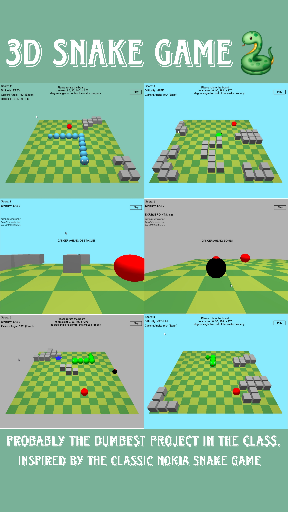

# 🐍 3D Snake Game
A modern take on the classic Snake game - reimagined in 3D using Python and OpenGL. This game includes immersive visuals, multiple camera modes (including first-person), dynamic difficulty settings, obstacles, bombs, and special effects, all packed into a single Python file.

## Github Repository

[**3D Snake Game**](https://github.com/mebmrauf/3D-Snake-Game)

## Screenshot

